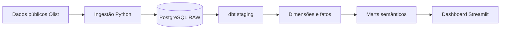

# LeadPulse Analytics

Produto analítico de portfólio que conecta aquisição, ativação e desempenho de vendedores em uma camada semântica governada e um dashboard executivo.

Desenvolvido para o portfólio **Do Código à Decisão**, o projeto utiliza dados públicos da Olist e um cenário de investimento de marketing explicitamente simulado.

---

## O problema

Leads, aquisição de vendedores e pedidos acontecem em momentos e fontes diferentes.

Sem contratos claros de dados, torna-se difícil responder perguntas como:

* quantos leads se tornaram vendedores;
* quantos vendedores começaram efetivamente a vender;
* quanto GMV esses vendedores geraram;
* quais origens apresentaram melhor desempenho;
* como um cenário de investimento em marketing se relaciona com esses resultados.

O projeto estrutura essas informações sem confundir associação com causalidade.

---

## A solução

O LeadPulse implementa um pipeline analítico completo:

1. ingestão de dados públicos da Olist com Python;
2. persistência em PostgreSQL;
3. transformação e testes com dbt;
4. modelagem dimensional com dimensões e fatos;
5. criação de marts semânticos orientados ao negócio;
6. dashboard executivo desenvolvido em Streamlit.

A interface apresenta o funil de aquisição, ativação dos vendedores em 90 dias, pedidos, GMV e indicadores de eficiência de marketing, com filtros por período, origem e canal.

---

## Principais resultados

* **8.000** leads qualificados;
* **842** vendedores adquiridos;
* **10,53%** de conversão de lead para vendedor;
* **42,15%** de taxa de ativação entre vendedores com janela completa de 90 dias;
* **4.457** pedidos realizados por vendedores adquiridos;
* **R$ 664,9 mil** de GMV observado;
* **R$ 333,1 mil** de investimento no cenário sintético de marketing.

> **Nota:** o investimento de marketing é simulado e não representa gasto observado da Olist.

---

## Arquitetura



O dashboard consome somente a camada semântica governada, evitando dependência direta de tabelas raw, staging ou fatos de baixo nível.

---

## Stack

**Python 3.12** · **PostgreSQL 16** · **dbt** · **Docker Compose** · **Streamlit** · **Plotly**

---

## Indicadores disponíveis

### Aquisição

* Leads qualificados
* Negócios fechados
* Vendedores adquiridos
* Conversão de lead para vendedor

### Ativação

* Vendedores com janela completa de 90 dias
* Vendedores ativados
* Taxa de ativação
* Tempo até a primeira venda
* GMV nos primeiros 90 dias
* GMV por vendedor ativado
* Pedidos por vendedor ativado

### Desempenho comercial

* Pedidos de vendedores adquiridos
* GMV dos vendedores adquiridos
* Desempenho por origem e período

### Eficiência de marketing

* Investimento de marketing simulado
* Custo por lead
* Custo por vendedor adquirido
* Retorno de GMV sobre investimento

---

## Qualidade de dados

A camada analítica possui contratos para:

* chaves e unicidade;
* integridade referencial;
* valores aceitos;
* grains dos fatos e marts;
* consistência temporal;
* proteção contra fanout;
* reconciliação entre fatos e marts;
* idempotência das cargas.

A release atual possui **203 testes dbt** aprovados.

A suíte Python também valida ingestão, configuração, formatação, agregações, filtros, mensagens de erro seguras, integração com PostgreSQL e navegação do dashboard.

---

## Execução rápida

Se os dados já foram provisionados e a camada analítica já foi construída, basta iniciar o LeadPulse pelos starters disponíveis na raiz do projeto.

### Windows

```powershell
start.bat
```

ou:

```powershell
.\start.ps1
```

### Linux/macOS

```bash
chmod +x start.sh
./start.sh
```

Os starters verificam automaticamente:

* Python e versão compatível;
* ambiente virtual `.venv`;
* dependências;
* configuração `.env`;
* Docker;
* PostgreSQL;
* semantic marts;
* Streamlit.

Com o ambiente pronto, acesse:

```text
http://localhost:8501
```

> Em um clone novo, os datasets Olist precisam ser obtidos e a camada analítica construída antes da primeira execução completa.

---

## Primeira execução

Os datasets públicos da Olist **não são versionados neste repositório**.

### 1. Configuração local

No PowerShell:

```powershell
Copy-Item .env.example .env
```

O arquivo `.env` é local e permanece fora do Git.

### 2. Ambiente Python

```powershell
python -m venv .venv
.\.venv\Scripts\Activate.ps1
python -m pip install -e ".[dev,data,dashboard]"
```

### 3. PostgreSQL

```powershell
docker compose up -d
```

O banco é executado via Docker e utiliza volume persistente.

### 4. Dados Olist

Baixe os snapshots públicos conforme os [contratos de fonte](docs/data/source-contracts.md).

Os arquivos devem ser mantidos na estrutura esperada dentro de:

```text
data/raw/
```

Os datasets brutos permanecem fora do Git.

### 5. Ingestão

```powershell
python -m leadpulse.ingestion mql
python -m leadpulse.ingestion closed-deals
python -m leadpulse.ingestion sellers
python -m leadpulse.ingestion orders
python -m leadpulse.ingestion order-items
```

Gere e carregue o cenário sintético de marketing:

```powershell
python -m leadpulse.synthetic
python -m leadpulse.ingestion synthetic-spend
```

### 6. Camada analítica

```powershell
python -m dotenv run -- dbt debug --project-dir transform --profiles-dir transform
python -m dotenv run -- dbt run --project-dir transform --profiles-dir transform
python -m dotenv run -- dbt test --project-dir transform --profiles-dir transform
```

### 7. Dashboard

Depois da preparação inicial:

```powershell
.\start.ps1
```

ou:

```powershell
start.bat
```

Também é possível executar manualmente:

```powershell
python -m streamlit run app/app.py --server.port 8501
```

Acesse:

```text
http://localhost:8501
```

---

## Requisitos

Para executar o projeto localmente:

* Python compatível com a versão definida em `pyproject.toml`;
* Docker com Docker Compose;
* datasets públicos da Olist para a primeira construção;
* portas locais utilizadas por PostgreSQL e Streamlit disponíveis.

Os starters **não**:

* instalam Python;
* instalam Docker;
* removem `.venv`;
* removem volumes;
* apagam dados;
* sobrescrevem `.env` existente.

---

## Demo pública

A demonstração pública ainda **não está disponível**.

O projeto está preparado para deployment containerizado e uma versão online será posteriormente disponibilizada no ecossistema **Do Código à Decisão**.

Até lá, o dashboard pode ser executado localmente seguindo as instruções deste README.

---

## Metodologia e limitações

* o investimento de marketing é **sintético, determinístico e reproduzível**;
* os valores simulados não representam gastos reais da Olist;
* o retorno de GMV sobre investimento é uma métrica **não causal**;
* GMV representa o valor bruto dos itens vendidos por vendedores adquiridos;
* frete não é incluído no GMV;
* valores de pagamento não são utilizados no cálculo de GMV;
* GMV não representa receita, lucro ou faturamento corporativo;
* ativação considera uma janela governada de **90 dias**;
* vendedores sem janela completa de observação não são classificados como não ativados;
* os dados representam um **snapshot histórico estático**, não uma operação em tempo real.

---

## Documentação

* [Contratos de KPIs](docs/business/kpi-contract.md)
* [Semântica analítica](docs/business/analytics-semantics.md)
* [Contratos das fontes](docs/data/source-contracts.md)
* [Manifesto das fontes](docs/data/source-manifest.md)
* [Modelo dimensional](docs/architecture/dimensional-model.md)
* [Arquitetura da plataforma](docs/architecture/physical-data-platform.md)

---

**Do Código à Decisão** — projetos de dados construídos para transformar código e dados em decisões.

O ponto importante: **não coloque ` ```markdown ` antes do `# LeadPulse Analytics` nem ` ``` ` no final do arquivo**. Esses delimitadores servem só para eu exibir Markdown como texto aqui no chat; se forem copiados para o próprio `README.md`, o GitHub entende todo o conteúdo como código — exatamente o que aconteceu no seu print.
