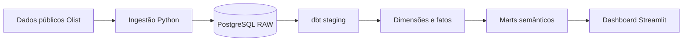

````markdown
# LeadPulse Analytics

Produto analítico de portfólio que conecta aquisição, ativação e desempenho de vendedores em uma camada semântica governada e um dashboard executivo.

Desenvolvido para o portfólio **Do Código à Decisão**, o projeto utiliza dados públicos da Olist e um cenário de investimento de marketing explicitamente simulado.

## Execução rápida

Depois de preparar os dados na primeira execução, o projeto pode ser iniciado com:

### Windows

```powershell
start.bat
````

ou:

```powershell
.\start.ps1
```

### Linux/macOS

```bash
chmod +x start.sh
./start.sh
```

O dashboard será disponibilizado em:

```text
http://localhost:8501
```

Os starters verificam automaticamente o ambiente Python, a `.venv`, as dependências, a configuração local, o Docker, o PostgreSQL, a camada analítica e o Streamlit.

> Em um clone novo, os datasets Olist precisam ser obtidos e a camada analítica construída antes da primeira execução completa.

---

## O problema

Leads, aquisição de vendedores e pedidos acontecem em momentos e fontes diferentes.

Sem contratos claros de dados, torna-se difícil responder perguntas como:

* quantos leads se tornaram vendedores;
* quantos vendedores começaram efetivamente a vender;
* quanto GMV esses vendedores geraram;
* quais origens apresentaram melhor desempenho;
* como um cenário de investimento em marketing se relaciona com esses resultados.

O projeto estrutura essas informações sem confundir associação com causalidade.

---

## A solução

O LeadPulse implementa um pipeline analítico completo:

1. ingestão de dados públicos da Olist com Python;
2. persistência em PostgreSQL;
3. transformação e testes com dbt;
4. modelagem dimensional com dimensões e fatos;
5. criação de marts semânticos orientados ao negócio;
6. dashboard executivo desenvolvido em Streamlit.

A interface apresenta o funil de aquisição, ativação dos vendedores em 90 dias, pedidos, GMV e indicadores de eficiência de marketing, com filtros por período, origem e canal.

---

## Principais resultados

* **8.000** leads qualificados;
* **842** vendedores adquiridos;
* **10,53%** de conversão de lead para vendedor;
* **42,15%** de taxa de ativação entre vendedores com janela completa de 90 dias;
* **4.457** pedidos realizados por vendedores adquiridos;
* **R$ 664,9 mil** de GMV observado;
* **R$ 333,1 mil** de investimento no cenário sintético de marketing.

> O investimento de marketing é simulado e não representa gasto observado da Olist.

---

## Arquitetura



O dashboard consome somente a camada semântica governada, evitando dependência direta de tabelas raw, staging ou fatos de baixo nível.

---

## Stack

**Python 3.12 · PostgreSQL 16 · dbt · Docker Compose · Streamlit · Plotly**

---

## Indicadores disponíveis

### Aquisição

* Leads qualificados;
* Negócios fechados;
* Vendedores adquiridos;
* Conversão de lead para vendedor.

### Ativação

* Vendedores com janela completa de 90 dias;
* Vendedores ativados;
* Taxa de ativação;
* Tempo até a primeira venda;
* GMV nos primeiros 90 dias;
* GMV por vendedor ativado;
* Pedidos por vendedor ativado.

### Desempenho comercial

* Pedidos de vendedores adquiridos;
* GMV dos vendedores adquiridos;
* desempenho por origem e período.

### Eficiência de marketing

* Investimento de marketing simulado;
* Custo por lead;
* Custo por vendedor adquirido;
* retorno de GMV sobre investimento.

---

## Qualidade de dados

A camada analítica possui contratos para:

* chaves e unicidade;
* integridade referencial;
* valores aceitos;
* grains dos fatos e marts;
* consistência temporal;
* proteção contra fanout;
* reconciliação entre fatos e marts;
* idempotência das cargas.

A release atual possui **203 testes dbt** aprovados.

A suíte Python também valida:

* ingestão;
* configuração;
* formatação;
* agregações;
* filtros;
* mensagens de erro seguras;
* integração com PostgreSQL;
* navegação do dashboard.

---

## Executar localmente

### Execução rápida

Se o projeto já possui os dados carregados e a camada analítica construída:

#### Windows

```powershell
start.bat
```

ou:

```powershell
.\start.ps1
```

#### Linux/macOS

```bash
chmod +x start.sh
./start.sh
```

Os starters:

* verificam a versão do Python;
* criam ou reutilizam `.venv`;
* sincronizam as dependências;
* verificam o arquivo `.env`;
* validam Docker e Docker Compose;
* iniciam o PostgreSQL;
* verificam a camada analítica;
* validam o Streamlit;
* iniciam o dashboard.

Quando o ambiente estiver pronto:

```text
http://localhost:8501
```

---

### Primeira execução após clonar o repositório

Os datasets públicos da Olist **não são versionados neste repositório**.

Por isso, um clone novo precisa passar pela preparação inicial abaixo.

#### 1. Criar a configuração local

No PowerShell:

```powershell
Copy-Item .env.example .env
```

O arquivo `.env` permanece fora do Git.

---

#### 2. Criar o ambiente Python

```powershell
python -m venv .venv
.\.venv\Scripts\Activate.ps1
```

Instale as dependências do projeto:

```powershell
python -m pip install -e ".[dev,data,dashboard]"
```

---

#### 3. Iniciar o PostgreSQL

```powershell
docker compose up -d
```

O PostgreSQL é executado em container Docker e mantém seus dados em volume persistente.

---

#### 4. Obter os datasets

Baixe os snapshots públicos da Olist conforme os [contratos de fonte](docs/data/source-contracts.md).

Mantenha os arquivos dentro da estrutura indicada em:

```text
data/raw/
```

Os arquivos brutos permanecem fora do versionamento Git.

---

#### 5. Executar a ingestão

```powershell
python -m leadpulse.ingestion mql
python -m leadpulse.ingestion closed-deals
python -m leadpulse.ingestion sellers
python -m leadpulse.ingestion orders
python -m leadpulse.ingestion order-items
```

Gere o cenário sintético de marketing:

```powershell
python -m leadpulse.synthetic
```

Carregue o cenário gerado:

```powershell
python -m leadpulse.ingestion synthetic-spend
```

---

#### 6. Construir a camada analítica

Valide a configuração do dbt:

```powershell
python -m dotenv run -- dbt debug --project-dir transform --profiles-dir transform
```

Construa os modelos:

```powershell
python -m dotenv run -- dbt run --project-dir transform --profiles-dir transform
```

Execute os testes:

```powershell
python -m dotenv run -- dbt test --project-dir transform --profiles-dir transform
```

Após essa etapa, os semantic marts utilizados pelo dashboard estarão disponíveis.

---

#### 7. Iniciar o dashboard

Você pode usar o starter:

```powershell
.\start.ps1
```

ou:

```powershell
start.bat
```

Também é possível iniciar manualmente:

```powershell
python -m streamlit run app/app.py --server.port 8501
```

Acesse:

```text
http://localhost:8501
```

---

### Execução manual

Caso prefira não utilizar os starters:

```powershell
Copy-Item .env.example .env

python -m venv .venv
.\.venv\Scripts\Activate.ps1

python -m pip install -e ".[dev,data,dashboard]"

docker compose up -d
```

Após provisionar os datasets e construir a camada analítica:

```powershell
python -m streamlit run app/app.py --server.port 8501
```

---

### Requisitos

Para executar o LeadPulse localmente são necessários:

* Python compatível com a versão definida em `pyproject.toml`;
* Docker com Docker Compose;
* datasets públicos da Olist para a primeira construção;
* acesso às portas locais utilizadas por PostgreSQL e Streamlit.

Os starters:

* não instalam Python automaticamente;
* não instalam Docker;
* não removem ambientes existentes;
* não removem volumes;
* não apagam dados;
* não sobrescrevem `.env` existente.

---

## Demo pública

A demonstração pública ainda **não está disponível**.

O projeto já está preparado para deployment containerizado e uma versão online será posteriormente disponibilizada no ecossistema **Do Código à Decisão**.

Até lá, o dashboard pode ser executado localmente seguindo as instruções deste README.

---

## Metodologia e limitações

* o investimento de marketing é **sintético, determinístico e reproduzível**;
* os valores simulados não representam gastos reais da Olist;
* o retorno de GMV sobre investimento é uma métrica **não causal**;
* GMV representa o valor bruto dos itens vendidos por vendedores adquiridos;
* frete não é incluído no GMV;
* valores de pagamento não são utilizados no cálculo de GMV;
* GMV não representa receita, lucro ou faturamento corporativo;
* ativação considera uma janela governada de **90 dias**;
* vendedores sem janela completa de observação não são classificados como não ativados;
* os dados representam um **snapshot histórico estático**, não uma operação em tempo real.

---

## Documentação

Documentação detalhada do projeto:

* [Contratos de KPIs](docs/business/kpi-contract.md)
* [Semântica analítica](docs/business/analytics-semantics.md)
* [Contratos das fontes](docs/data/source-contracts.md)
* [Manifesto das fontes](docs/data/source-manifest.md)
* [Modelo dimensional](docs/architecture/dimensional-model.md)
* [Arquitetura da plataforma](docs/architecture/physical-data-platform.md)

```
```
