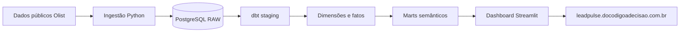

# LeadPulse Analytics

Produto analítico de portfólio que conecta aquisição, ativação e desempenho de
vendedores em uma camada semântica governada e um dashboard executivo. Desenvolvido
para o portfólio **Do Código à Decisão** com dados públicos Olist e um cenário de
investimento de marketing explicitamente simulado.

> **Public demo deployment target:**
> <https://leadpulse.docodigoadecisao.com.br> — a URL é o alvo de publicação e não
> deve ser considerada online até a infraestrutura passar pela aceitação de release.

As capturas finais previstas estão documentadas em
[`docs/assets/README.md`](docs/assets/README.md); imagens provisórias não são
versionadas.

## O problema

Leads, aquisição de vendedores e pedidos vivem em momentos e fontes diferentes.
Sem contratos claros, é difícil responder quantos leads viraram vendedores, quantos
começaram a vender, quanto GMV geraram e como um cenário de investimento se compara
a esse resultado — sem confundir associação com causalidade.

## A solução

O projeto ingere snapshots governados no PostgreSQL, transforma os dados com dbt e
publica quatro marts semânticos consumidos por um dashboard Streamlit. A interface
apresenta o funil de aquisição, ativação em 90 dias, pedidos, GMV e eficiência de
marketing com filtros de período, origem e canal.

## Principais resultados

- **8.000** leads qualificados;
- **842** vendedores adquiridos e **10,53%** de conversão;
- **42,15%** de taxa de ativação entre vendedores com janela completa de 90 dias;
- **4.457** pedidos e **R$ 664,9 mil** de GMV observado dos vendedores adquiridos;
- **R$ 333,1 mil** de investimento no cenário sintético, nunca tratado como gasto observado.

## Arquitetura



No ambiente público, Caddy termina HTTPS e encaminha apenas o dashboard; o
PostgreSQL permanece privado e é acessado por um usuário read-only com grants por
coluna. Veja [a arquitetura de publicação](docs/deployment/public-demo.md).

## Stack

Python 3.12 · PostgreSQL 16 · dbt · Docker/Compose · Streamlit · Plotly

## Qualidade de dados

Os contratos cobrem chaves, relacionamentos, valores aceitos, grains e
reconciliações entre fatos e marts: **203 testes dbt** passam na release v1.0. A
suíte Python também valida formatação, agregação, filtros, erros seguros,
integração e navegação via AppTest.

## Executar localmente

No PowerShell, a partir da raiz do repositório:

```powershell
Copy-Item .env.example .env
python -m venv .venv
.\.venv\Scripts\Activate.ps1
python -m pip install -e ".[dev,data,dashboard]"
docker compose up -d
```

Baixe os snapshots Olist conforme os
[contratos de fonte](docs/data/source-contracts.md), mantendo-os em `data/raw/`, e
execute a ingestão:

```powershell
python -m leadpulse.ingestion mql
python -m leadpulse.ingestion closed-deals
python -m leadpulse.ingestion sellers
python -m leadpulse.ingestion orders
python -m leadpulse.ingestion order-items
python -m leadpulse.synthetic
python -m leadpulse.ingestion synthetic-spend
```

Construa e valide a camada analítica, depois inicie o dashboard:

```powershell
python -m dotenv run -- dbt debug --project-dir transform --profiles-dir transform
python -m dotenv run -- dbt run --project-dir transform --profiles-dir transform
python -m dotenv run -- dbt test --project-dir transform --profiles-dir transform
python -m streamlit run app/app.py --server.port 8501
```

Acesse <http://localhost:8501>. Nenhum `export` manual é necessário: aplicação e
ingestão carregam `.env`, e o dbt é iniciado por `python-dotenv`.

## Public demo

A imagem de produção executa Streamlit como usuário sem privilégios e possui
healthcheck. `docker-compose.prod.yml` demonstra o contrato Streamlit + Caddy sem
incorporar credenciais. DNS, host, banco privado e secrets ainda são entradas da
infraestrutura de publicação.

Instruções operacionais: [`docs/deployment/public-demo.md`](docs/deployment/public-demo.md).

## Metodologia e limitações

- o investimento de marketing é sintético, determinístico e não representa gasto da Olist;
- o retorno de GMV sobre investimento é não causal;
- GMV é o valor bruto dos itens vendidos por vendedores adquiridos; exclui frete,
  não usa valor de pagamento e não representa receita, lucro ou faturamento da empresa;
- ativação usa uma janela completa e governada de 90 dias;
- os dados formam um snapshot histórico estático, não uma operação em tempo real.

Contratos detalhados: [KPIs](docs/business/kpi-contract.md),
[semântica analítica](docs/business/analytics-semantics.md),
[fontes](docs/data/source-manifest.md) e
[arquitetura](docs/architecture/physical-data-platform.md).
